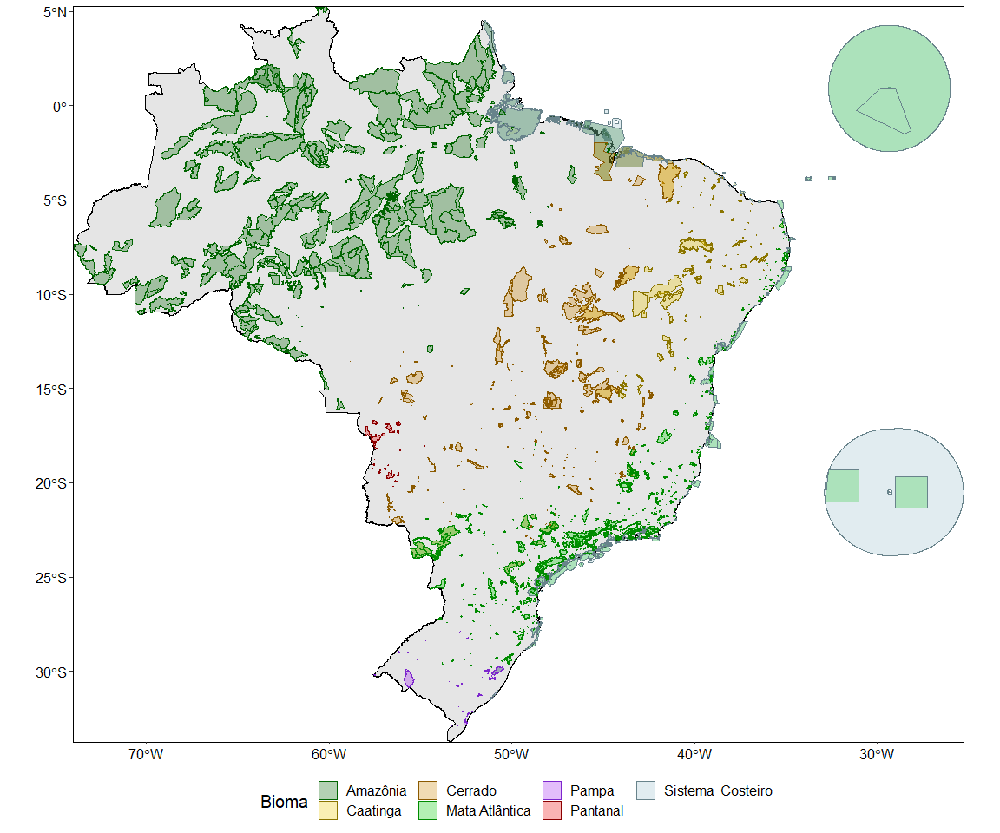

Unidades de conservação em território brasileiro
================
Edson Nilton de Moura SIlva Júnior
2024-01-24

<style>
body {
text-align: justify;
font-size: 20px}
blockquote {
  background-color: #FAEFA6;
  padding: 10px;
  font-size: 14.5px
}

# **Pacotes**

``` r
library(tidyverse) 

library(sf)
```

# **Dados**

## Unidades de conservação, baixadas do [Cadastro Nacional de Unidades de Conservação](https://cnuc.mma.gov.br/map)

``` r
ucs <- unzip("ucs.zip")

ucs <- ucs[3] %>% 
  sf::st_read()
```

    ## Reading layer `ucs' from data source 
    ##   `G:\Meu Drive\UFPE\boana semilineata\ucs.shp' 
    ##   using driver `ESRI Shapefile'
    ## Simple feature collection with 2736 features and 30 fields
    ## Geometry type: MULTIPOLYGON
    ## Dimension:     XY
    ## Bounding box:  xmin: -73.99121 ymin: -32.93031 xmax: -25.29095 ymax: 5.27191
    ## Geodetic CRS:  SIRGAS 2000

``` r
ucs
```

    ## Simple feature collection with 2736 features and 30 fields
    ## Geometry type: MULTIPOLYGON
    ## Dimension:     XY
    ## Bounding box:  xmin: -73.99121 ymin: -32.93031 xmax: -25.29095 ymax: 5.27191
    ## Geodetic CRS:  SIRGAS 2000
    ## First 10 features:
    ##    gml_id uc_id      cd_cnuc  wdpa_pid
    ## 1    <NA>     2 0000.00.0002     31755
    ## 2    <NA>     4 0000.00.0004     19752
    ## 3    <NA>     6 0000.00.0006    351716
    ## 4    <NA>     7 0000.00.0007    115993
    ## 5    <NA>    11 0000.00.0011 555600306
    ## 6    <NA>    12 0000.00.0012     31758
    ## 7    <NA>    13 0000.00.0013     19458
    ## 8    <NA>    14 0000.00.0014     19484
    ## 9    <NA>    15 0000.00.0015    116096
    ## 10   <NA>    16 0000.00.0016    351840
    ##                                                      nome_uc
    ## 1             ÁREA DE PROTEÇÃO AMBIENTAL CAVERNAS DO PERUAÇU
    ## 2  ÁREA DE PROTEÇÃO AMBIENTAL DA BACIA DO RIO SÃO BARTOLOMEU
    ## 3                ÁREA DE PROTEÇÃO AMBIENTAL DA BALEIA FRANCA
    ## 4         ÁREA DE PROTEÇÃO AMBIENTAL BARRA DO RIO MAMANGUAPE
    ## 5            ÁREA DE PROTEÇÃO AMBIENTAL SERRA DA MANTIQUEIRA
    ## 6              ÁREA DE PROTEÇÃO AMBIENTAL SERRA DA TABATINGA
    ## 7                      ÁREA DE PROTEÇÃO AMBIENTAL DE CAIRUÇU
    ## 8      ÁREA DE PROTEÇÃO AMBIENTAL DE CANANÉIA-IGUAPÉ-PERUÍBE
    ## 9          ÁREA DE PROTEÇÃO AMBIENTAL DE FERNANDO DE NORONHA
    ## 10                 ÁREA DE PROTEÇÃO AMBIENTAL DE GUAPI-MIRIM
    ##      cria_ano                     cria_ato
    ## 1  28-09-1989  Decreto 98182 de 26-09-1989
    ## 2  07-11-1983  Decreto 88940 de 07-11-1983
    ## 3  14-09-2000     Decreto SN de 14-09-2000
    ## 4  07-03-1998    Decreto 924 de 10-09-1993
    ## 5  06-06-1985  Decreto 91304 de 03-06-1985
    ## 6  16-07-2002 Decreto 99.278 de 06-06-1990
    ## 7  27-12-1983  Decreto 89242 de 27-12-1983
    ## 8  06-11-1995  Decreto 90347 de 23-10-1984
    ## 9  05-06-1986  Decreto 92755 de 05-06-1986
    ## 10 25-09-1984  Decreto 90225 de 25-09-1984
    ##                                        outro_ato
    ## 1                                 Sem informação
    ## 2                                 Sem informação
    ## 3                                 Sem informação
    ## 4  Decreto S/N de 07-03-1998 Revisão dos limites
    ## 5                                 Sem informação
    ## 6              Decreto S/N de 16-07-2002 Redução
    ## 7                                 Sem informação
    ## 8          Decreto 91892 de 06-11-1995 Ampliação
    ## 9                                 Sem informação
    ## 10                                Sem informação
    ##         pl_manejo      co_gestor
    ## 1  Sem informação            Sim
    ## 2  Sem informação Sem informação
    ## 3  Sem informação            Sim
    ## 4             Sim            Sim
    ## 5             Sim            Sim
    ## 6  Sem informação Sem informação
    ## 7             Sim            Sim
    ## 8             Sim            Sim
    ## 9             Sim            Sim
    ## 10            Sim            Sim
    ##                                      quali_pol
    ## 1  Polígono corresponde ao memorial descritivo
    ## 2  Polígono corresponde ao memorial descritivo
    ## 3  Polígono corresponde ao memorial descritivo
    ## 4  Polígono corresponde ao memorial descritivo
    ## 5  Polígono corresponde ao memorial descritivo
    ## 6  Polígono corresponde ao memorial descritivo
    ## 7  Polígono corresponde ao memorial descritivo
    ## 8  Polígono corresponde ao memorial descritivo
    ## 9  Polígono corresponde ao memorial descritivo
    ## 10 Polígono corresponde ao memorial descritivo
    ##                                                                                                                                   ppgr
    ## 1                                                                                                   Mosaico Serta?o Veredas - Peruac?u
    ## 2                                                                                                                                 <NA>
    ## 3                                                                              Projeto Áreas Marinhas e Costeiras Protegidas ? GEF Mar
    ## 4                                                                                                                                 <NA>
    ## 5                                                                                                                  Mosaico Mantiqueira
    ## 6                                                                                                                     Mosaico Jalapa?o
    ## 7                                                                                        Mosaico Bocaina, Parati e Ilha Grande (Misto)
    ## 8  Mosaico Litoral de São Paulo, Projeto Áreas Marinhas e Costeiras Protegidas ? GEF Mar, Sítio Ramsar APA Cananéia - Iguape - Peruíbe
    ## 9                                                                              Projeto Áreas Marinhas e Costeiras Protegidas ? GEF Mar
    ## 10                                                                                                                                <NA>
    ##     ha_total ha_ato  esfera
    ## 1  143353.29 143866 Federal
    ## 2   82679.26      0 Federal
    ## 3  154867.71 156100 Federal
    ## 4   14918.26  14640 Federal
    ## 5   437517.1 411184 Federal
    ## 6   41779.16  61000 Federal
    ## 7   32610.33  32688 Federal
    ## 8     202307 196955 Federal
    ## 9  154365.88 154000 Federal
    ## 10  13890.26  13950 Federal
    ##                                         uf
    ## 1                             MINAS GERAIS
    ## 2                         DISTRITO FEDERAL
    ## 3                           SANTA CATARINA
    ## 4                                  PARAÍBA
    ## 5  MINAS GERAIS, RIO DE JANEIRO, SÃO PAULO
    ## 6                                TOCANTINS
    ## 7                           RIO DE JANEIRO
    ## 8                                SÃO PAULO
    ## 9                               PERNAMBUCO
    ## 10                          RIO DE JANEIRO
    ##                                                                                                                                                                                                                                                         municipio
    ## 1                                                                                                                                                                                       BONITO DE MINAS (MG), CÔNEGO MARINHO (MG), ITACARAMBI (MG), JANUÁRIA (MG)
    ## 2                                                                                                                                                                                                                                                   BRASÍLIA (DF)
    ## 3                                                                                                                         FLORIANÓPOLIS (SC), GAROPABA (SC), IÇARA (SC), IMBITUBA (SC), JAGUARUNA (SC), LAGUNA (SC), PALHOÇA (SC), PAULO LOPES (SC), TUBARÃO (SC)
    ## 4                                                                                                                                                                                                BAÍA DA TRAIÇÃO (PB), LUCENA (PB), MARCAÇÃO (PB), RIO TINTO (PB)
    ## 5  AIURUOCA (MG), ALAGOA (MG), BAEPENDI (MG), BOCAINA DE MINAS (MG), CAMPOS DO JORDÃO (SP), CRUZEIRO (SP), DELFIM MOREIRA (MG), GUARATINGUETÁ (SP), ITAMONTE (MG), ITANHANDU (MG), ITATIAIA (RJ), LAVRINHAS (SP), LIBERDADE (MG), LORENA (SP), MARMELÓPOLIS (MG),
    ## 6                                                                                                                                                                                                                                                   MATEIROS (TO)
    ## 7                                                                                                                                                                                                                                                     PARATY (RJ)
    ## 8                                                                                                                                                                       CANANÉIA (SP), IGUAPE (SP), ILHA COMPRIDA (SP), ITARIRI (SP), MIRACATU (SP), PERUÍBE (SP)
    ## 9                                                                                                                                                                                                                                        FERNANDO DE NORONHA (PE)
    ## 10                                                                                                                                                                                                    GUAPIMIRIM (RJ), ITABORAÍ (RJ), MAGÉ (RJ), SÃO GONÇALO (RJ)
    ##                                                 org_gestor
    ## 1  INSTITUTO CHICO MENDES DE CONSERVAÇÃO DA BIODIVERSIDADE
    ## 2  INSTITUTO CHICO MENDES DE CONSERVAÇÃO DA BIODIVERSIDADE
    ## 3  INSTITUTO CHICO MENDES DE CONSERVAÇÃO DA BIODIVERSIDADE
    ## 4  INSTITUTO CHICO MENDES DE CONSERVAÇÃO DA BIODIVERSIDADE
    ## 5  INSTITUTO CHICO MENDES DE CONSERVAÇÃO DA BIODIVERSIDADE
    ## 6  INSTITUTO CHICO MENDES DE CONSERVAÇÃO DA BIODIVERSIDADE
    ## 7  INSTITUTO CHICO MENDES DE CONSERVAÇÃO DA BIODIVERSIDADE
    ## 8  INSTITUTO CHICO MENDES DE CONSERVAÇÃO DA BIODIVERSIDADE
    ## 9  INSTITUTO CHICO MENDES DE CONSERVAÇÃO DA BIODIVERSIDADE
    ## 10 INSTITUTO CHICO MENDES DE CONSERVAÇÃO DA BIODIVERSIDADE
    ##              grupo                  categoria
    ## 1  Uso Sustentável Área de Proteção Ambiental
    ## 2  Uso Sustentável Área de Proteção Ambiental
    ## 3  Uso Sustentável Área de Proteção Ambiental
    ## 4  Uso Sustentável Área de Proteção Ambiental
    ## 5  Uso Sustentável Área de Proteção Ambiental
    ## 6  Uso Sustentável Área de Proteção Ambiental
    ## 7  Uso Sustentável Área de Proteção Ambiental
    ## 8  Uso Sustentável Área de Proteção Ambiental
    ## 9  Uso Sustentável Área de Proteção Ambiental
    ## 10 Uso Sustentável Área de Proteção Ambiental
    ##      cat_iucn amazonia caatinga   cerrado matlantica
    ## 1  Category V     <NA> 26660.87 116692.42       <NA>
    ## 2  Category V     <NA>     <NA>  82679.26       <NA>
    ## 3  Category V     <NA>     <NA>      <NA>    34957.2
    ## 4  Category V     <NA>    336.3      <NA>   22738.56
    ## 5  Category V     <NA>     <NA>      <NA>   437517.1
    ## 6  Category V     <NA>     <NA>  76964.58       <NA>
    ## 7  Category V     <NA>     <NA>      <NA>   31819.73
    ## 8  Category V     <NA>     <NA>      <NA>   411204.4
    ## 9  Category V     <NA>     <NA>      <NA>      776.5
    ## 10 Category V     <NA>     <NA>      <NA>    8965.06
    ##    pampa pantanal   marinho situacao limite
    ## 1   <NA>     <NA>      <NA>    Ativo     uc
    ## 2   <NA>     <NA>      <NA>    Ativo     uc
    ## 3   <NA>     <NA> 119934.73    Ativo     uc
    ## 4   <NA>     <NA>   6761.68    Ativo     uc
    ## 5   <NA>     <NA>      <NA>    Ativo     uc
    ## 6   <NA>     <NA>      <NA>    Ativo     uc
    ## 7   <NA>     <NA>    798.63    Ativo     uc
    ## 8   <NA>     <NA>    902.81    Ativo     uc
    ## 9   <NA>     <NA> 153584.23    Ativo     uc
    ## 10  <NA>     <NA>   4925.19    Ativo     uc
    ##                          geometry
    ## 1  MULTIPOLYGON (((-44.67889 -...
    ## 2  MULTIPOLYGON (((-47.50479 -...
    ## 3  MULTIPOLYGON (((-48.47895 -...
    ## 4  MULTIPOLYGON (((-34.91617 -...
    ## 5  MULTIPOLYGON (((-44.75234 -...
    ## 6  MULTIPOLYGON (((-45.69821 -...
    ## 7  MULTIPOLYGON (((-44.71935 -...
    ## 8  MULTIPOLYGON (((-47.44195 -...
    ## 9  MULTIPOLYGON (((-29.26691 0...
    ## 10 MULTIPOLYGON (((-42.98541 -...

``` r
ucs %>% 
  ggplot() +
  geom_sf()
```

<!-- -->

## Território brasileiro, baixado do [Instituto Brasileiro de Geografia Estatística](https://geoftp.ibge.gov.br/organizacao_do_territorio/malhas_territoriais/malhas_municipais/municipio_2022/Brasil/BR/BR_Pais_2022.zip)

``` r
br <- unzip("BR_Pais_2022.zip")

br <- br[4] %>% 
  sf::st_read()
```

    ## Reading layer `BR_Pais_2022' from data source 
    ##   `G:\Meu Drive\UFPE\boana semilineata\BR_Pais_2022.shp' 
    ##   using driver `ESRI Shapefile'
    ## Simple feature collection with 1 feature and 2 fields
    ## Geometry type: MULTIPOLYGON
    ## Dimension:     XY
    ## Bounding box:  xmin: -73.99045 ymin: -33.75118 xmax: -28.84764 ymax: 5.271841
    ## Geodetic CRS:  SIRGAS 2000

``` r
br
```

    ## Simple feature collection with 1 feature and 2 fields
    ## Geometry type: MULTIPOLYGON
    ## Dimension:     XY
    ## Bounding box:  xmin: -73.99045 ymin: -33.75118 xmax: -28.84764 ymax: 5.271841
    ## Geodetic CRS:  SIRGAS 2000
    ##   NM_PAIS AREA_KM2                       geometry
    ## 1  Brasil  8510418 MULTIPOLYGON (((-41.82601 -...

``` r
br %>% 
  ggplot() +
  geom_sf()
```

<!-- -->

# **Áreas em Km²**

## Território brasileiro

``` r
br_area <- br %>% 
  sf::st_area() / 1000000

br_area
```

    ## 8510419 [m^2]

## Unidades de conservação

``` r
sf::sf_use_s2(FALSE)

ucs_area <- ucs %>% 
  sf::st_make_valid() %>% 
  sf::st_union() %>% 
  sf::st_area() / 1000000
```

    ## although coordinates are longitude/latitude,
    ## st_union assumes that they are planar

``` r
ucs_area
```

    ## 2509476 [m^2]

## % dá área das unidades de conservação sobre o território brasileiro

``` r
ucs_area * 100 / br_area 
```

    ## 29.4871 [1]

## Áreas ocupadas por Unidades de conservação em Km² por bioma

``` r
ucs %>% 
  sf::st_make_valid() %>% 
  dplyr::mutate(`Área em Km²` = ucs %>% sf::st_make_valid() %>% sf::st_area() / 1000000 ) %>% 
  tidyr::pivot_longer(cols = amazonia:marinho,
                      names_to = "Bioma",
                      values_to = "values") %>% 
  dplyr::filter(!values %>% is.na()) %>% 
  dplyr::mutate(Bioma = dplyr::case_when(Bioma == "amazonia" ~ "Amazônia",
                                         Bioma == "matlantica" ~ "Mata Atlântica",
                                         Bioma == "caatinga" ~ "Caatinga",
                                         Bioma == "cerrado" ~ "Cerrado",
                                         Bioma == "pampa" ~ "Pampa",
                                         Bioma == "pantanal" ~ "Pantanal",
                                         Bioma == "marinho" ~ "Sistema Costeiro")) %>% 
  dplyr::group_by(Bioma) %>% 
  dplyr::summarise(`Área de Unidades de conservação em Km² por bioma` = sum(`Área em Km²`) %>% round(2)) %>% 
  dplyr::mutate(`Área de Unidades de conservação em Km² por bioma` = `Área de Unidades de conservação em Km² por bioma` %>% stringr::str_remove(" [m^2]")) %>% 
  as.data.frame() %>% 
  dplyr::select(1:2)
```

    ## although coordinates are longitude/latitude,
    ## st_union assumes that they are planar

    ##              Bioma
    ## 1         Amazônia
    ## 2         Caatinga
    ## 3          Cerrado
    ## 4   Mata Atlântica
    ## 5            Pampa
    ## 6         Pantanal
    ## 7 Sistema Costeiro
    ##   Área de Unidades de conservação em Km² por bioma
    ## 1                                       1233492.73
    ## 2                                        111030.01
    ## 3                                        240816.61
    ## 4                                        667334.15
    ## 5                                          6069.52
    ## 6                                          6784.63
    ## 7                                        1085434.9

# **Distribuição das unidades de conservação ao longo dos biomas**

``` r
ucs %>% 
  sf::st_make_valid() %>% 
  dplyr::mutate(`Área em Km²` = ucs %>% sf::st_make_valid() %>% sf::st_area() / 1000000 %>% as.numeric()) %>% 
  tidyr::pivot_longer(cols = amazonia:marinho,
                      names_to = "Bioma",
                      values_to = "values") %>% 
  dplyr::filter(!values %>% is.na()) %>% 
  dplyr::mutate(Bioma = dplyr::case_when(Bioma == "amazonia" ~ "Amazônia",
                                         Bioma == "matlantica" ~ "Mata Atlântica",
                                         Bioma == "caatinga" ~ "Caatinga",
                                         Bioma == "cerrado" ~ "Cerrado",
                                         Bioma == "pampa" ~ "Pampa",
                                         Bioma == "pantanal" ~ "Pantanal",
                                         Bioma == "marinho" ~ "Sistema Costeiro")) %>% 
  ggplot() +
  geom_sf(data = br, color = "black") +
  geom_sf(aes(fill = Bioma, color = Bioma), alpha = 0.3) +
  scale_fill_manual(values = c("darkgreen", "gold2", "orange3", "green3", "purple", "red2", "lightblue3")) +
  scale_color_manual(values = c("darkgreen", "gold4", "orange4", "green4", "purple3", "red4", "lightblue4")) +
  scale_x_continuous(expand = c(0, 0)) +
  scale_y_continuous(expand = c(0, 0)) +
  theme(axis.text = element_text(color = "black", size = 12),
        axis.title = element_text(color = "black", size = 15),
        panel.grid = element_blank(),
        panel.grid.minor = element_blank(),
        panel.ontop = T,
        axis.line = element_blank(),
        plot.background = element_rect(fill = "white", color = "white"),
        panel.background = element_blank(),
        panel.border = element_rect(colour = "black", fill = NA, linewidth = 0.45),
        legend.key = element_rect(color = "white", fill = "white"),
        legend.title = element_text(hjust = 0.5, size = 15),
        legend.position = "bottom",
        legend.text = ggtext::element_markdown(color = "black", size = 12),
        strip.background = element_rect(colour = "black", fill = "gray90"),
        strip.text.x = element_text(size = 13))
```

<!-- -->
